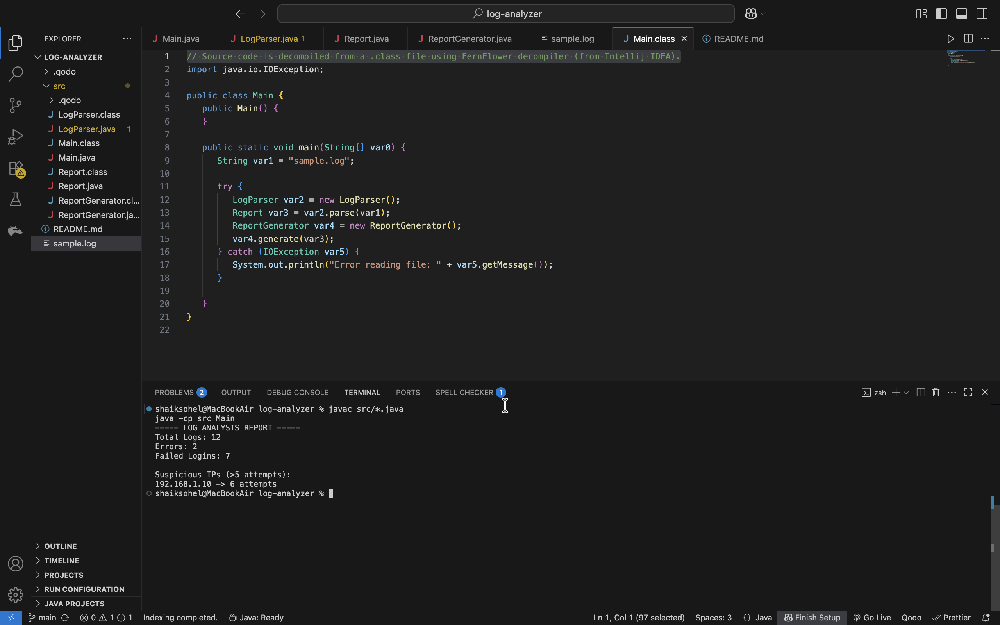

# Smart Log Analyzer (Java)

## 📌 Description
A Java-based tool to analyze server logs and detect:
- Errors
- Failed login attempts
- Suspicious IP addresses

## ⚙️ Features
- Parses log files
- Counts errors and login failures
- Detects suspicious IPs (>5 attempts)
- Generates summary report

## 🛠️ Tech Stack
- Java
- File Handling
- HashMap

## ▶️ How to Run
1. Compile:
   javac src/*.java

2. Run:
   java -cp src Main

## 📊 Sample Output
Total Logs: 12  
Errors: 2  
Failed Logins: 7  

Suspicious IPs:  
192.168.1.10 -> 6 attempts

## 🚀 Future Improvements
- Real-time log monitoring
- Web dashboard
- Cloud integration

## 📊 Sample Output

## 🧠 Learning Outcome
- Learned Java file handling and parsing
- Used HashMap for tracking frequency
- Implemented basic log analysis logic similar to real-world systems