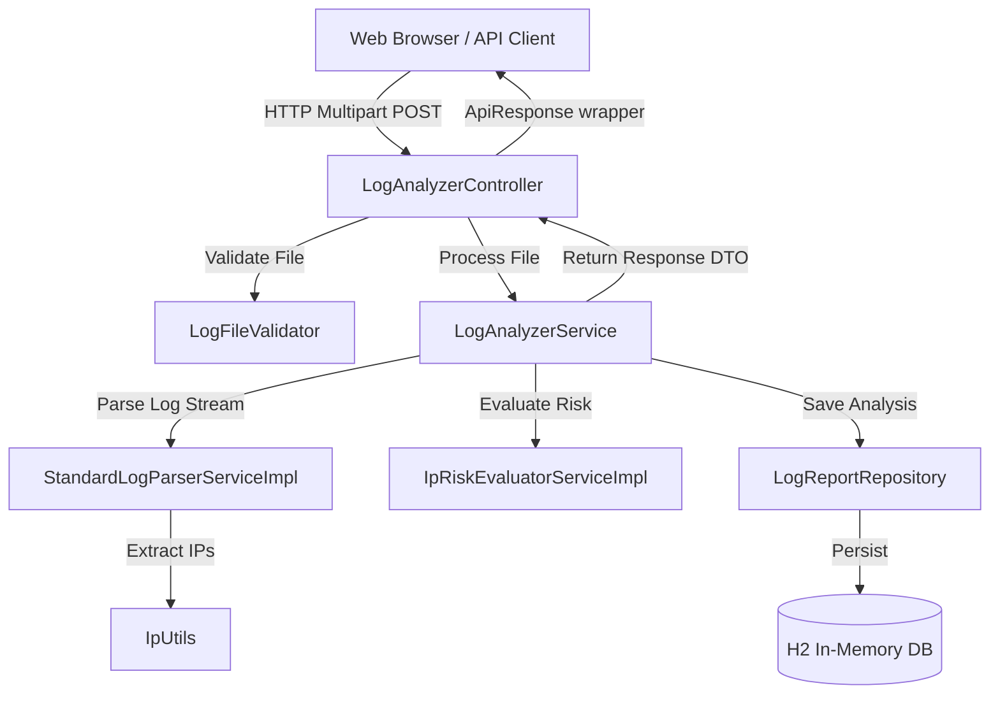

# 🛡️ Smart Log Analyzer (Enterprise Edition)

[](https://www.oracle.com/java/)
[](https://spring.io/projects/spring-boot)
[](LICENSE)
[](#)

A production-ready enterprise security & operational log monitoring application built with **Java 17**, **Spring Boot 3.4**, **Spring Security**, **Spring Data JPA**, **H2 In-Memory DB**, **SLF4J/Logback**, **Swagger/OpenAPI 3**, **Docker**, and a modern **Glassmorphic Responsive Dashboard**.

---

## 🌟 Executive Summary & Features

**Smart Log Analyzer** parses system log files, evaluates security threats (e.g. brute-force SSH/authentication attempts), calculates risk levels for IP addresses, tracks operational errors, and persists analysis reports for audit and historical trend reporting.

### Key Capabilities
- **Multi-Format Log Parser**: Efficiently parses log files (`.log`, `.txt`, `.out`), counting total logs, errors, and failed password entries using pattern matching (`IpUtils`).
- **Dynamic Threat Risk Engine**: Categorizes suspicious IPs into **CRITICAL**, **HIGH**, **MEDIUM**, and **LOW** risk levels with automated mitigation recommendations based on failed attempt thresholds.
- **Enterprise Layered Architecture**: Adheres strictly to SOLID design principles, clean separation of concerns, and dependency injection.
- **Global Exception Handling**: Returns standardized JSON API envelopes (`ApiResponse<T>`) across all endpoints and exception scenarios.
- **Structured SLF4J / Logback Logging**: Configured colorized console logging and daily rolling file appenders (`logs/loganalyzer.log`).
- **Interactive Modern Dashboard**: Features a responsive dark/light glassmorphic UI with drag-and-drop file upload, real-time KPI metrics, interactive Chart.js visualizations, searchable threat table, sample log launcher, and JSON report export.
- **OpenAPI 3 / Swagger Documentation**: Embedded Swagger UI at `/swagger-ui.html` for interactive API exploration.
- **Docker & Compose Ready**: Multi-stage lightweight Docker image build and `docker-compose` setup.
- **Automated CI/CD**: GitHub Actions workflow for automated Maven testing and artifact building.

---

## 🏗️ Architecture & Package Design

The application follows a clean 4-tier layered enterprise architecture:

```
com.sohel.loganalyzer
├── LoganalyzerApplication.java  # Application Entry Point
├── config                       # OpenAPI Swagger Documentation Configuration
├── controller                   # REST API Layer with OpenAPI Annotations
├── dto                          # Data Transfer Objects & Standard ApiResponse<T> Envelopes
├── exception                    # Custom Exceptions & @RestControllerAdvice Global Exception Handler
├── model                        # JPA Entities (LogReport) & Domain Result Objects
├── repository                   # Spring Data JPA Repository Interfaces
├── security                     # Spring Security Filter Chain & CORS Configuration
├── service                      # Service Interfaces & Implementations
│   └── impl                     # StandardLogParser, IpRiskEvaluator, LogAnalyzerService
├── util                         # IP Regex Utilities, File Helpers (ByteArrayMultipartFile)
└── validation                   # Multipart File Validator Component
```

### Component & Data Flow Diagram


```mermaid
graph TD
    Client[Web Browser / API Client] -->|HTTP Multipart POST| Controller[LogAnalyzerController]
    Controller -->|Validate File| Validator[LogFileValidator]
    Controller -->|Process File| Service[LogAnalyzerService]
    Service -->|Parse Log Stream| Parser[StandardLogParserServiceImpl]
    Parser -->|Extract IPs| IpUtil[IpUtils]
    Service -->|Evaluate Risk| Evaluator[IpRiskEvaluatorServiceImpl]
    Service -->|Save Analysis| Repo[LogReportRepository]
    Repo -->|Persist| H2[(H2 In-Memory DB)]
    Service -->|Return Response DTO| Controller
    Controller -->|ApiResponse wrapper| Client
```

---

## 🚀 Quick Start Guide

### Prerequisites
- **Java JDK 17+**
- **Maven 3.8+** (or use included `./mvnw`)
- **Docker & Docker Compose** (optional for containerized execution)

---

### Running Locally with Maven

1. **Clone the repository:**
   ```bash
   git clone https://github.com/ShaikSohel1/smart-log-analyzer-java.git
   cd smart-log-analyzer-java
   ```

2. **Run unit & integration tests:**
   ```bash
   ./mvnw clean test
   ```

3. **Start the application:**
   ```bash
   ./mvnw spring-boot:run
   ```

4. **Access the Application:**
   - 🌐 **Dashboard UI**: `http://localhost:8080`
   - 📖 **Swagger UI Documentation**: `http://localhost:8080/swagger-ui.html`
   - 🗄️ **H2 Database Console**: `http://localhost:8080/h2-console`

---

### Running with Docker & Docker Compose

Build and launch the application in a lightweight containerized environment:

```bash
docker-compose up --build -d
```

To view container logs:
```bash
docker-compose logs -f
```

To stop the container:
```bash
docker-compose down
```

---

## 📡 REST API Reference

All API responses follow the standard `ApiResponse<T>` wrapper schema:

```json
{
  "success": true,
  "message": "Log file analyzed successfully.",
  "status": 200,
  "timestamp": "2026-08-01T11:27:28.000",
  "data": { ... }
}
```

### Endpoints Overview

| Method | Endpoint | Description |
| :--- | :--- | :--- |
| `POST` | `/api/logs/analyze` | Upload log file (`.log`, `.txt`) for analysis & threat scoring |
| `GET` | `/api/logs/sample` | Analyze built-in sample log file instantly |
| `GET` | `/api/logs/history` | Retrieve 10 most recent analysis reports summary |
| `GET` | `/api/logs/history/{id}`| Fetch detailed report by Report ID |

---

### Sample Request & Response (`POST /api/logs/analyze`)

**cURL Request:**
```bash
curl -X POST "http://localhost:8080/api/logs/analyze" \
  -H "accept: application/json" \
  -H "Content-Type: multipart/form-data" \
  -F "file=@sample.log"
```

**JSON Response Payload:**
```json
{
  "success": true,
  "message": "Log file analyzed successfully.",
  "status": 200,
  "timestamp": "2026-08-01T11:27:28.019",
  "data": {
    "id": 1,
    "fileName": "sample.log",
    "fileSize": 345,
    "totalLogs": 12,
    "errorCount": 2,
    "failedLogins": 7,
    "suspiciousIpCount": 1,
    "overallStatus": "ELEVATED_RISK",
    "ipActivities": [
      {
        "ipAddress": "192.168.1.10",
        "attemptCount": 6,
        "riskLevel": "MEDIUM",
        "recommendation": "Flag for security monitoring and enforce CAPTCHA / Rate limiting."
      }
    ],
    "processedAt": "2026-08-01T11:27:28.019"
  }
}
```

---

## 🧪 Testing & Code Quality

The project includes **17 automated unit and integration tests** covering all layers:

- **Unit Tests**: `IpUtilsTest`, `LogFileValidatorTest`, `IpRiskEvaluatorServiceTest`, `StandardLogParserServiceTest`
- **Integration Tests**: `LogAnalyzerControllerTest` (MockMvc), `LoganalyzerApplicationTests`

Run all tests via command line:
```bash
./mvnw clean test
```

---

## 💻 Tech Stack Summary

- **Core**: Java 17, Spring Boot 3.4.2
- **Security**: Spring Security 6 (CORS, CSRF rules, Headers)
- **Database**: H2 In-Memory Database, Spring Data JPA, Hibernate 6
- **Validation**: Spring Boot Validation (Hibernate Validator)
- **Documentation**: SpringDoc OpenAPI 3.0 (Swagger UI)
- **Logging**: SLF4J, Logback (Color Console & Rolling Daily File Appender)
- **Frontend**: HTML5, CSS3 Glassmorphism System, ES6+ JavaScript, Chart.js, FontAwesome
- **DevOps**: Docker, Docker Compose, GitHub Actions CI