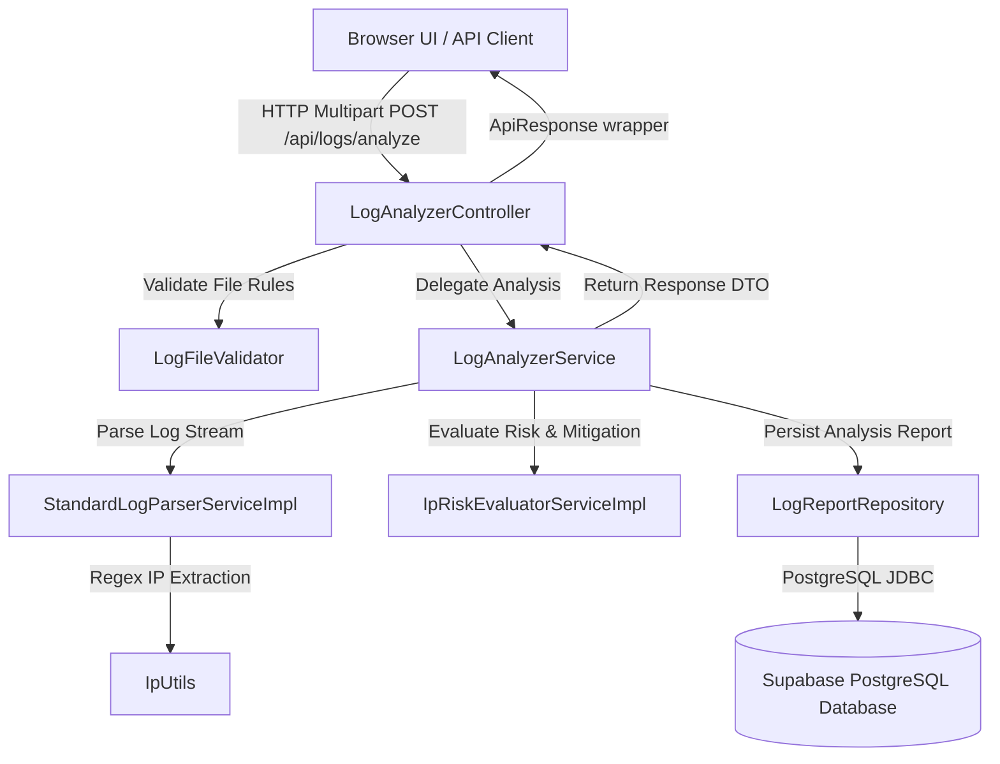

# 🛡️ Smart Log Analyzer (Enterprise Security & Operational Intelligence)

[](https://www.oracle.com/java/)
[](https://spring.io/projects/spring-boot)
[](https://supabase.com/)
[](LICENSE)
[](#)

A production-grade enterprise security and operational log monitoring platform built with **Java 17**, **Spring Boot 3.4**, **Spring Security**, **Spring Data JPA**, **Supabase PostgreSQL**, **SLF4J/Logback**, **Swagger/OpenAPI 3**, **Docker**, and an interactive **Glassmorphic Security Dashboard UI**.

---

## 🌟 Executive Summary & Features

**Smart Log Analyzer** parses system and application log streams, detects operational errors and security authentication failures (such as SSH brute-force attempts), evaluates threat risk levels for suspicious IP addresses, and persists historical analysis reports into a **Supabase PostgreSQL** database for auditability and trend reporting.

### Key Capabilities
- **Multi-Format Log Parser**: Efficiently parses `.log`, `.txt`, and `.out` log files, tracking total log entries, severity errors, and authentication failures via regular expression pattern matching (`IpUtils`).
- **Dynamic Threat Risk Engine**: Categorizes suspicious IPs (exceeding 5 failed login attempts) into **CRITICAL**, **HIGH**, **MEDIUM**, and **LOW** risk levels, generating automated security mitigation recommendations based on failed attempt thresholds.
- **Overall System Risk Scoring**: Calculates overall system health status (**CRITICAL_ALERT**, **ELEVATED_RISK**, **NORMAL**) based on cumulative error and threat activity.
- **Dual Database Architecture**: Integrated with **Supabase PostgreSQL** for persistent database storage in production and isolated **H2 In-Memory DB** for test execution.
- **Interactive Security Dashboard UI**: Features a dark/light glassmorphic single-page web interface with drag-and-drop log upload, real-time KPI metrics, interactive Chart.js analytics, searchable threat activity tables, built-in sample log executor, and JSON report export.
- **Standardized API Envelope**: All REST API endpoints return a uniform `ApiResponse<T>` JSON wrapper containing status codes, messages, ISO timestamps, and payload data.
- **Global Exception Handling**: Centralized `@RestControllerAdvice` exception handler mapping file validation errors, resource missing errors, file size limits, and internal processing exceptions to standardized HTTP responses.
- **OpenAPI 3 / Swagger Documentation**: Interactive API documentation embedded at `/swagger-ui.html` and OpenAPI specification at `/v3/api-docs`.
- **Docker & Containerization**: Multi-stage lightweight Docker image build (`Dockerfile`) and containerized environment via `docker-compose.yml`.
- **Automated CI/CD**: GitHub Actions workflow (`.github/workflows/ci.yml`) for automated Maven compilation, unit/integration testing, and JAR artifact packaging.

---

## 🏗️ Architecture & Component Flow

The application adheres strictly to SOLID design principles, clean separation of concerns, and dependency injection across a 4-tier enterprise architecture.

```
com.sohel.loganalyzer
├── LoganalyzerApplication.java  # Application Entry Point & Bootstrapper
├── config                       # SpringDoc OpenAPI 3 Configuration
├── controller                   # REST Controllers & Swagger Annotations
├── dto                          # Data Transfer Objects & Standard ApiResponse<T> Envelopes
├── exception                    # Custom Exceptions & @RestControllerAdvice Global Handler
├── model                        # JPA Entities (LogReport) & Domain Result Objects
├── repository                   # Spring Data JPA Repositories (Supabase PostgreSQL / H2)
├── security                     # Spring Security Filter Chain & CORS Configuration
├── service                      # Service Interfaces & Business Implementations
│   └── impl                     # StandardLogParserServiceImpl, IpRiskEvaluatorServiceImpl
├── util                         # IPv4 Regex Parser (IpUtils), ByteArrayMultipartFile Helper
└── validation                   # Multipart File Validator Component
```

### Request & Analysis Flow Diagram


```mermaid
graph TD
    Client[Browser UI / API Client] -->|HTTP Multipart POST /api/logs/analyze| Controller[LogAnalyzerController]
    Controller -->|Validate File Rules| Validator[LogFileValidator]
    Controller -->|Delegate Analysis| Service[LogAnalyzerService]
    Service -->|Parse Log Stream| Parser[StandardLogParserServiceImpl]
    Parser -->|Regex IP Extraction| IpUtil[IpUtils]
    Service -->|Evaluate Risk & Mitigation| Evaluator[IpRiskEvaluatorServiceImpl]
    Service -->|Persist Analysis Report| Repo[LogReportRepository]
    Repo -->|PostgreSQL JDBC| Supabase[(Supabase PostgreSQL Database)]
    Service -->|Return Response DTO| Controller
    Controller -->|ApiResponse wrapper| Client
```

---

## 💻 Technical Stack

| Tier | Technologies |
| :--- | :--- |
| **Language & Core** | Java 17 (Eclipse Temurin JDK 17), Maven 3.9+ |
| **Framework** | Spring Boot 3.4.2 (Spring Web, Spring Security 6, Spring Data JPA, Hibernate 6) |
| **Database** | Supabase PostgreSQL 17.11 (`org.postgresql:postgresql`), H2 In-Memory DB (Testing Profile) |
| **Documentation** | SpringDoc OpenAPI 3.0 (`springdoc-openapi-starter-webmvc-ui:2.8.5`) |
| **Logging** | SLF4J, Logback (Color Console & Rolling Daily File Appender in `logs/loganalyzer.log`) |
| **Frontend UI** | HTML5, Vanilla CSS3 (Glassmorphic System), ES6+ JavaScript, Chart.js, FontAwesome 6 |
| **DevOps & CI/CD** | Docker, Docker Compose, GitHub Actions (`ci.yml`) |

---

## 📡 REST API Documentation

All API responses follow the standard `ApiResponse<T>` wrapper envelope:

```json
{
  "success": true,
  "message": "Log file analyzed successfully.",
  "status": 200,
  "timestamp": "2026-10-04T18:03:46.153",
  "data": { ... }
}
```

### Endpoints Overview

| Method | Endpoint | Description | Consumes / Produces |
| :--- | :--- | :--- | :--- |
| `POST` | `/api/logs/analyze` | Upload log file (`.log`, `.txt`, `.out`) for parsing & security scoring | `multipart/form-data` → `application/json` |
| `GET` | `/api/logs/sample` | Execute analysis on built-in sample log file instantly | `application/json` |
| `GET` | `/api/logs/history` | Fetch 10 most recent analysis reports summary from database | `application/json` |
| `GET` | `/api/logs/history/{id}`| Fetch full detailed report by database Report ID | `application/json` |

---

### API Endpoint Details & Request Examples

#### 1. Analyze Log File (`POST /api/logs/analyze`)

- **URL**: `/api/logs/analyze`
- **Method**: `POST`
- **Content-Type**: `multipart/form-data`
- **Parameters**: `file` (MultipartFile, Required, Max 10MB)

**cURL Request:**
```bash
curl -X POST "http://localhost:8080/api/logs/analyze" \
  -H "accept: application/json" \
  -H "Content-Type: multipart/form-data" \
  -F "file=@sample.log"
```

**JSON Response (200 OK):**
```json
{
  "success": true,
  "message": "Log file analyzed successfully.",
  "status": 200,
  "timestamp": "2026-10-04T18:03:46.153",
  "data": {
    "id": 1,
    "fileName": "sample.log",
    "fileSize": 5469,
    "totalLogs": 57,
    "errors": 6,
    "errorCount": 6,
    "failedLogins": 43,
    "suspiciousIpCount": 4,
    "suspiciousIPs": {
      "198.51.100.45": 18,
      "203.0.113.195": 12,
      "45.33.32.156": 7,
      "192.168.1.100": 6
    },
    "ipActivities": [
      {
        "ipAddress": "198.51.100.45",
        "attemptCount": 18,
        "riskLevel": "CRITICAL",
        "recommendation": "Immediately block IP at firewall level and trigger incident response workflow."
      },
      {
        "ipAddress": "203.0.113.195",
        "attemptCount": 12,
        "riskLevel": "HIGH",
        "recommendation": "Block IP address and reset associated user accounts."
      }
    ],
    "overallStatus": "CRITICAL_ALERT",
    "processedAt": "2026-10-04T18:03:44.138"
  }
}
```

#### 2. Analyze Built-in Sample Log (`GET /api/logs/sample`)

- **URL**: `/api/logs/sample`
- **Method**: `GET`
- **Description**: Runs analysis on the system's built-in `sample.log` file without requiring a file upload.

#### 3. Fetch Recent Analysis History (`GET /api/logs/history`)

- **URL**: `/api/logs/history`
- **Method**: `GET`
- **Description**: Retrieves top 10 most recent analysis reports stored in Supabase PostgreSQL database ordered by creation date descending.

#### 4. Get Report Details by ID (`GET /api/logs/history/{id}`)

- **URL**: `/api/logs/history/{id}`
- **Method**: `GET`
- **Path Variable**: `id` (Long, Required)
- **Description**: Retrieves full `LogReport` JPA entity details for the specified ID.

---

## 🔍 Log Parsing & Threat Detection Logic

### 1. Keyword Classification Rules
- **Total Log Count**: Every line in the stream increments `totalLogs`.
- **Severity Errors**: Lines containing `ERROR` increment `errorCount`.
- **Authentication Failures**: Lines containing `Failed password` increment `failedLogins` and trigger IPv4 address extraction via `IpUtils.extractIp(line)`.

### 2. Suspicious IP Threshold
An IP address is tracked as suspicious if its cumulative failed login attempt count exceeds **5** (`attemptCount > 5`).

### 3. IP Threat Risk Matrix (`IpRiskEvaluatorService`)

| Failed Attempts | Risk Level | Mitigation Recommendation |
| :--- | :--- | :--- |
| `> 15` | **CRITICAL** | Immediately block IP at firewall level and trigger incident response workflow. |
| `> 10` | **HIGH** | Block IP address and reset associated user accounts. |
| `> 5` | **MEDIUM** | Flag for security monitoring and enforce CAPTCHA / Rate limiting. |
| `<= 5` | **LOW** | Normal threshold. Monitor login attempts. |

### 4. Overall System Health Status

| Condition | Overall Status | Indicator |
| :--- | :--- | :--- |
| `suspiciousIpCount > 3` OR `failedLogins > 20` | **CRITICAL_ALERT** | Crimson Pulse Indicator |
| `suspiciousIpCount > 0` OR `errorCount > 5` OR `failedLogins > 5` | **ELEVATED_RISK** | Amber Pulse Indicator |
| Otherwise | **NORMAL** | Emerald Pulse Indicator |

---

## ⚙️ Configuration & Environment Variables

The application can be configured via environment variables or `application.properties`:

| Property / Environment Variable | Default Value | Description |
| :--- | :--- | :--- |
| `server.port` | `8080` | HTTP server port |
| `SUPABASE_DB_URL` | `jdbc:postgresql://aws-0-ap-southeast-1.pooler.supabase.com:5432/postgres?sslmode=require` | Supabase PostgreSQL JDBC URL |
| `SUPABASE_DB_USER` | `postgres.qkzfopcohwqjiblyemgh` | Database username |
| `SUPABASE_DB_PASSWORD` | `${SUPABASE_DB_PASSWORD:}` | Database user password (passed via environment) |
| `spring.servlet.multipart.max-file-size` | `10MB` | Maximum single file upload size limit |

---

## 🚀 Quick Start Guide

### Prerequisites
- **Java JDK 17+**
- **Maven 3.8+** (or use the included `./mvnw` wrapper)
- **Docker & Docker Compose** *(optional for containerized execution)*

---

### Local Execution with Maven

1. **Clone the repository:**
   ```bash
   git clone https://github.com/ShaikSohel1/smart-log-analyzer-java.git
   cd smart-log-analyzer-java
   ```

2. **Run automated unit & integration test suite:**
   ```bash
   ./mvnw clean test
   ```

3. **Start the application:**
   ```bash
   # Optional: Export your Supabase database password
   export SUPABASE_DB_PASSWORD="YOUR_SUPABASE_PASSWORD"

   ./mvnw spring-boot:run
   ```

4. **Access the Application Services:**
   - 🌐 **Security Dashboard UI**: `http://localhost:8080`
   - 📖 **Swagger UI Documentation**: `http://localhost:8080/swagger-ui.html`
   - 🗄️ **OpenAPI JSON Spec**: `http://localhost:8080/v3/api-docs`

---

### Execution with Docker & Docker Compose

1. **Build and run via Docker Compose:**
   ```bash
   docker-compose up --build -d
   ```

2. **Inspect container logs:**
   ```bash
   docker-compose logs -f
   ```

3. **Stop container:**
   ```bash
   docker-compose down
   ```

---

## 🧪 Automated Testing Strategy

The project contains **17 automated unit and integration tests** covering all layers:

- **Unit Tests**:
  - `IpUtilsTest`: Verifies IPv4 pattern matching and fallback parsing.
  - `LogFileValidatorTest`: Validates null/empty files, 10MB file size limits, and allowed extensions (`.log`, `.txt`, `.out`).
  - `IpRiskEvaluatorServiceTest`: Evaluates risk scoring thresholds and recommendation rules.
  - `StandardLogParserServiceTest`: Verifies log parsing stream accuracy.
- **Integration Tests**:
  - `LogAnalyzerControllerTest`: Full MockMvc integration testing of all REST endpoints using `@ActiveProfiles("test")` with isolated H2 in-memory DB.
  - `LoganalyzerApplicationTests`: Verifies Spring ApplicationContext loading.

### Empirical Test Execution Result
Running `./mvnw clean test` produces clean pass results:
```text
[INFO] Results:
[INFO] 
[INFO] Tests run: 17, Failures: 0, Errors: 0, Skipped: 0
[INFO] 
[INFO] ------------------------------------------------------------------------
[INFO] BUILD SUCCESS
[INFO] ------------------------------------------------------------------------
[INFO] Total time:  5.007 s
```

---

## 📂 Project Directory Structure

```
smart-log-analyzer-java/
├── .github/
│   └── workflows/
│       └── ci.yml                    # GitHub Actions CI/CD Pipeline
├── legacy/                           # Legacy Java console prototypes
│   ├── LogParser.java
│   ├── Main.java
│   ├── Report.java
│   └── ReportGenerator.java
├── logs/                             # Application logs (Logback daily rolling)
├── src/
│   ├── main/
│   │   ├── java/com/sohel/loganalyzer/
│   │   │   ├── LoganalyzerApplication.java
│   │   │   ├── config/               # OpenAPI Swagger Config
│   │   │   ├── controller/           # LogAnalyzerController REST endpoints
│   │   │   ├── dto/                  # ApiResponse, LogAnalysisResponseDto, etc.
│   │   │   ├── exception/            # GlobalExceptionHandler & custom exceptions
│   │   │   ├── model/                # LogReport JPA entity & LogAnalysisResult
│   │   │   ├── repository/           # LogReportRepository (Spring Data JPA)
│   │   │   ├── security/             # SecurityConfig (CORS, CSRF, permitAll rules)
│   │   │   ├── service/              # LogAnalyzerService & Service Implementations
│   │   │   ├── util/                 # IpUtils & ByteArrayMultipartFile
│   │   │   └── validation/           # LogFileValidator
│   │   └── resources/
│   │       ├── application.properties# Main application configuration (Supabase)
│   │       ├── logback-spring.xml    # Color console & rolling file logging
│   │       ├── sample.log            # Built-in sample log file
│   │       └── static/               # Single-Page Dashboard (index.html, script.js, style.css)
│   └── test/
│       ├── java/com/sohel/loganalyzer/ # Unit & Integration Test Classes
│       └── resources/
│           └── application-test.properties # Test isolated H2 database properties
├── Dockerfile                        # Multi-stage Docker production build file
├── docker-compose.yml                # Docker Compose service definition
├── mvnw                              # Maven Wrapper executable script
├── pom.xml                           # Maven Project Object Model dependencies
├── sample.log                        # Root sample log file
└── README.md                         # Project documentation
```

---

## 🔒 Security & Performance Considerations

- **Secrets Protection**: Database passwords and credentials are configured via environment variables (`SUPABASE_DB_PASSWORD`) rather than hardcoded plaintext secrets.
- **Spring Security Configuration**: Configured with CORS policy, disabled CSRF for stateless REST APIs, same-origin frame options for embedded tools, and explicitly scoped `permitAll` rules for frontend dashboard, API docs, and API endpoints.
- **File Upload Limits**: Enforces strict 10MB maximum request size limit in both Spring Servlet Multipart resolver and `LogFileValidator` to prevent denial-of-service memory pressure.
- **Non-Root Docker Execution**: The `Dockerfile` creates a non-root system user (`appuser:appgroup`) to execute the compiled application securely inside the container.

---

## 📄 License & Status

- **Status**: Active & Verified
- **License**: Apache License 2.0