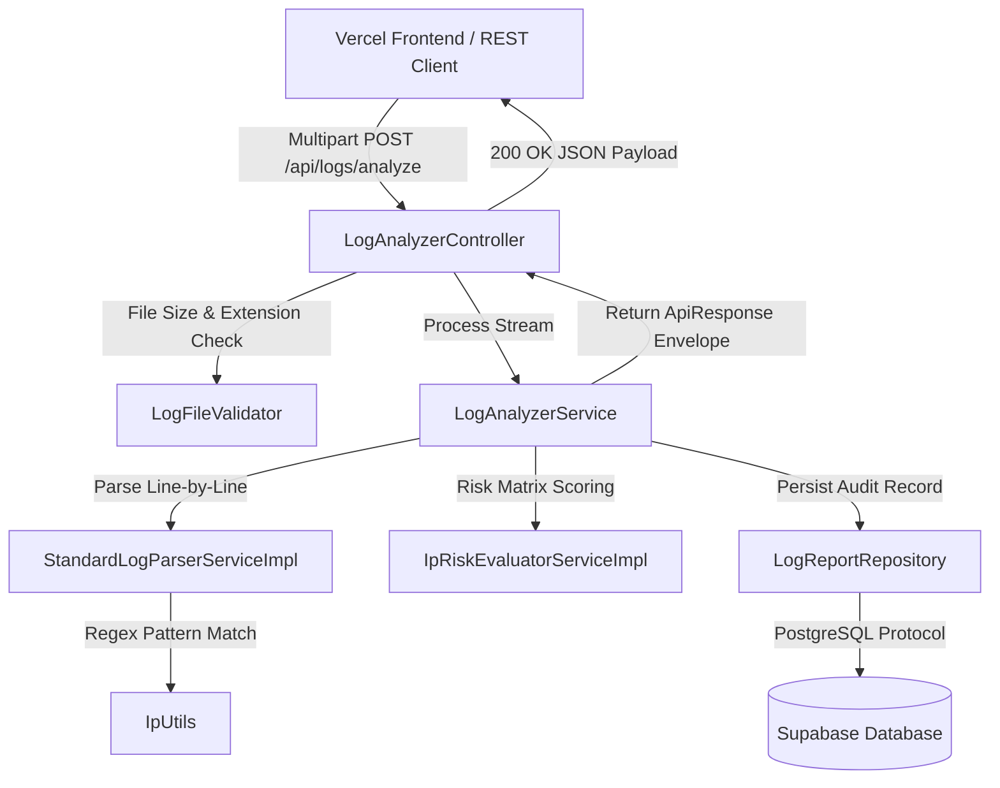

# 🏗️ System Architecture & Component Design

The **Smart Log Analyzer** enterprise platform follows a modern decoupled architecture designed for high availability, security monitoring, and seamless cloud deployment.

---

## 📐 Deployment & System Architecture

```
                    USER BROWSER
                         │
                         ▼
             ┌──────────────────────┐
             │    Vercel Hosting    │
             │ Single-Page Frontend │
             └───────────┬──────────┘
                         │
                     HTTPS REST
                         │
                         ▼
             ┌──────────────────────┐
             │    Render Hosting    │
             │  Spring Boot Engine  │
             └───────────┬──────────┘
                         │
                   JDBC Protocol
                         │
                         ▼
             ┌──────────────────────┐
             │  Supabase PostgreSQL │
             │ Analytics Data Store │
             └──────────────────────┘
```

---

## 🧩 Backend Component Layering

```
com.sohel.loganalyzer
├── LoganalyzerApplication.java  # Application Entry Point
├── config/                      # OpenAPI Swagger Documentation Specs
├── controller/                  # REST Controllers & Swagger Annotations
├── dto/                         # ApiResponse<T> Envelopes & Data Models
├── exception/                   # GlobalExceptionHandler (@RestControllerAdvice)
├── model/                       # LogReport Entity & Domain Result Objects
├── repository/                  # LogReportRepository (Spring Data JPA)
├── security/                    # SecurityConfig (CORS, CSRF, permitAll rules)
├── service/                     # Business Logic Interfaces & Implementations
│   └── impl/                    # StandardLogParserServiceImpl, IpRiskEvaluatorServiceImpl
├── util/                        # IpUtils IPv4 Regex Parser & ByteArrayMultipartFile
└── validation/                  # LogFileValidator Rules Engine
```

---

## 🔄 End-to-End Log Analysis Pipeline



---

## 🛡️ Security & Storage Strategy

- **In-Memory Stream Processing**: Uploaded log files are streamed directly into `InputStream` memory buffers, eliminating temporary local disk writes.
- **Database Persistence**: Parsed metric summaries and flagged IP addresses are stored permanently in the Supabase PostgreSQL `log_reports` database table.
- **Spring Security & CORS**: Configured with allowed origin patterns mapped to the `FRONTEND_URL` environment variable.
